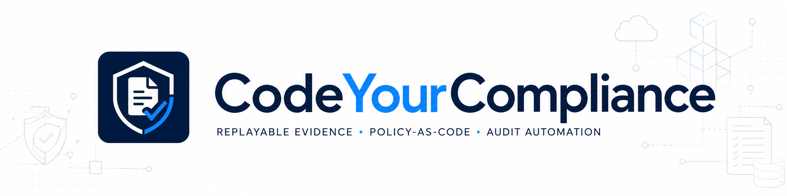

# Evidence Validation Pipeline


> A minimal MAS TRM-inspired evidence pipeline for evidence-first compliance automation.

This repository demonstrates a CodeYourCompliance technical pattern:

**Compliance automation should start with evidence, not reports.**

The goal is to show how a technical compliance finding can be derived from timestamped, integrity-checked, machine-evaluable evidence rather than from static screenshots, manual checklists, or after-the-fact reports.

This project is an architecture and demo asset. It is not legal, regulatory, audit, or certification advice.

## Project Origin and Attribution

This repository is part of **CodeYourCompliance**, a public technical project exploring MAS TRM-inspired compliance automation through replayable evidence, policy-as-code, and audit-ready evidence structures.

- Website: https://www.codeyourcompliance.com
- GitHub organization: https://github.com/codeyourcompliance
- Original repository: https://github.com/codeyourcompliance/evidence-validation-pipeline
- Companion article series: https://www.codeyourcompliance.com

This repository is the original public CodeYourCompliance implementation track for the `evidence-validation-pipeline` pattern.

If you reference, fork, adapt, or discuss this project, please preserve attribution to CodeYourCompliance and link back to the original repository.

## Boundary

MAS TRM-inspired means engineering interpretation. It does not mean MAS approval, certified compliance, legal advice, regulatory advice, audit sufficiency, or prescribed implementation.

This project does not claim that MAS TRM prescribes Ansible, SHA256, Python, OPA, Rego, JSON schemas, evidence replay, evidence requirements, artifact classification, or any specific implementation pattern.

The purpose is narrower: to explore how technical compliance evidence can be collected, timestamped, sealed, verified, evaluated, replayed, classified, and mapped to audit narratives.

## Position

A checklist is intake.

A screenshot is a supporting artifact.

A report is narrative.

Evidence is proof material.

A completed checklist cannot prove that a control was true at a specific point in time.

A screenshot can help explain what someone saw. It should not silently replace source-bound, timestamped, integrity-checked evidence.

A report cannot rescue stale evidence. It cannot repair a missing timestamp. It cannot prove that a configuration remained unchanged after collection.

This repository treats compliance automation as an evidence pipeline, not a checklist tracker, screenshot folder, or report generator.

The pipeline must make control claims harder to fake, harder to mutate, and easier to replay.

Reports persuade. Evidence survives.

## Purpose

The `evidence-validation-pipeline` project shows how to move from static audit narratives to replayable evidence workflows.

The minimal pipeline is:

1. Collect evidence from a target system in read-only mode.
2. Bind the evidence to a timestamp.
3. Generate an integrity hash for the evidence package.
4. Verify the evidence before policy evaluation.
5. Derive machine-readable facts.
6. Evaluate the facts with policy-as-code.
7. Generate a MAS TRM-inspired audit narrative.
8. Replay the same sealed evidence object later to test whether the conclusion still holds.
9. Map checklist items to explicit evidence requirements instead of treating checklist completion as proof.
10. Classify screenshots and other artifacts by evidentiary role before using them in reporting or policy evaluation.

The first demo scenario uses Apache HTTPD with TLS enabled. The target system is intentionally configured with a TLS certificate approaching expiry, such as within 48 hours, so the pipeline can produce a clear technical finding.

## Related Articles

This repository accompanies the CodeYourCompliance article series on MAS TRM-inspired compliance automation.

### Core Evidence Pipeline Series

#### Week 1

**Compliance Is Not Documentation. It Is Evidence That Can Be Replayed.**

Substack: https://www.codeyourcompliance.com/p/compliance-is-not-documentation-it-18e

The article introduces the core thesis behind this repository: compliance evidence should be collectible, timestamped, integrity-checked, machine-evaluable, and replayable.

#### Week 2

**Read-Only Collection as an Audit Boundary**

Substack: https://www.codeyourcompliance.com/p/read-only-collection-as-an-audit

The article explains why evidence collection should observe the target system without modifying it. Collection is evidence work. Remediation belongs in a separate workflow.

#### Week 3

**Compliance Automation Starts at Evidence.**

Substack: https://www.codeyourcompliance.com/p/compliance-automation-starts-at-evidence

The article sharpens the core boundary behind this repository: report automation is not evidence automation. It explains why policy evaluation should only occur after evidence has been collected, timestamped, sealed, and verified.

#### Week 4

**Can Your Audit Evidence Survive Replay?**

Substack: https://www.codeyourcompliance.com/p/can-your-audit-evidence-survive-replay

The article introduces an evidence replay self-test. It asks whether a sealed evidence object can be verified, evaluated, and replayed later.

#### Week 5

**What a MAS TRM Checklist Cannot Prove**

Substack: https://www.codeyourcompliance.com/p/what-a-mas-trm-checklist-cannot-prove

The article draws a hard boundary between checklist completion and proof. A MAS TRM checklist can organize compliance work. It cannot prove system state at a specific point in time.

#### Week 6

**A Screenshot Is a Supporting Artifact, Not a Proof Object**

Substack: https://www.codeyourcompliance.com/p/a-screenshot-is-a-supporting-artifact

The article classifies screenshots as supporting artifacts unless they satisfy the structure required for primary machine-verifiable evidence.

#### Week 7

**A Generated Report Is Not an Accountable Audit Conclusion**

Substack: https://www.codeyourcompliance.com/p/a-generated-report-is-not-an-accountable

The article separates evidence processing from accountable audit judgment. Generated reports can support review, but they do not own the conclusion.

#### Week 8

**Go-Live Is Not Workflow Evidence**

Substack: https://www.codeyourcompliance.com/p/go-live-is-not-workflow-evidence

The article separates delivery evidence from workflow evidence. A green dashboard may show deployment activity. It does not prove that the operating workflow changed or that the evidence can survive review.

#### Week 9

**Tool Approval Is Not Workflow Proof**

Substack: https://www.codeyourcompliance.com/p/tool-approval-is-not-workflow-proof

The article separates tool approval from workflow proof. Approval controls entry. Workflow-level evidence controls consequence.

### Adjacent Public Evidence Work

These articles apply the same claim-to-evidence discipline to AI vendor review and public trust signals. They are adjacent to this repository. They are not implementation increments of the evidence validation pipeline.

- **AI Vendor Risk Assessment: Vendor Claim Is Not Evidence**  
  https://www.codeyourcompliance.com/p/start-here-ai-vendor-risk-pack
- **AI Vendor Risk Is Not a Questionnaire Problem**  
  https://www.codeyourcompliance.com/p/ai-vendor-risk-is-not-a-questionnaire
- **Vendor Says It Does Not Train on Your Data. What Evidence Should You Ask For?**  
  https://www.codeyourcompliance.com/p/vendor-says-it-does-not-train-on
- **A Trust Center Is Not an AI Vendor Risk Assessment**  
  https://www.codeyourcompliance.com/p/a-trust-center-is-not-an-ai-vendor
- **Introducing the Trust Signal Directory**  
  https://www.codeyourcompliance.com/p/introducing-the-trust-signal-directory

## Content Relationship

- **Substack articles:** explain the problem language and architecture thesis.
- **This repository:** stores sample evidence structures, report examples, checklists, and implementation increments.
- **Week 2 increment:** adds the first read-only collection pattern.
- **Week 3 increment:** adds the evidence-first audit boundary, minimal evidence object, and invalid evidence result example.
- **Week 4 increment:** adds the evidence replay checklist and formalizes the replay boundary: same evidence, same policy, same conclusion.
- **Week 5 increment:** updates the replay checklist so checklist rows map to evidence requirements. It separates checklist, control, evidence, policy result, report, and proof material.
- **Week 6 increment:** adds screenshot evidence classification. It separates primary evidence, supporting artifact, manual claim, not machine-verifiable artifact, and invalid evidence.
- **Week 7 increment:** separates evidence processing from accountable audit judgment.
- **Week 8 increment:** separates delivery evidence from workflow evidence.
- **Week 9 increment:** separates tool approval from workflow proof.
- **Future releases:** will extend schema validation, integrity verification, replay examples, checklist-to-evidence mapping, artifact classification, OPA/Rego policy examples, and workflow-level evidence examples.

## Architecture Overview


In prose, the flow is simple:

System state is collected in read-only mode, packaged as timestamped evidence, sealed with an integrity hash, verified before policy evaluation, converted into derived facts, evaluated through policy logic, translated into an audit narrative, and later replayed against the same evidence object.

```text
System State
  -> Read-only Collection
  -> Timestamped Evidence
  -> Hash Seal
  -> Integrity Verification
  -> OPA Evaluation
  -> Audit Narrative
  -> Evidence Replay
```

The audit boundary starts before the report. Bad evidence should not produce a clean result.

## Checklist Gap

A checklist row is not proof.

A checklist row should map to an evidence requirement.

For example:

| Checklist item | What it claims | What it cannot prove | Evidence fields needed |
|---|---|---|---|
| TLS enabled | TLS is configured | When and where TLS state was observed | `observed_at`, `source_system`, `collector` |
| Certificate valid | Certificate was valid | Whether validity came from runtime state or human claim | `certificate_not_after`, `collection_method` |
| Logging enabled | Logs are enabled | Whether logs were actually generated and retained | `log_source`, `sample_window` |
| Access reviewed | User access was reviewed | Whether the user list came from the authoritative source | `identity_source`, `exported_at` |
| Vendor control confirmed | Vendor control exists | Whether this is evidence or only a vendor statement | `evidence_type`, `attestation_date` |

The checklist organizes the work.

The evidence requirement defines what must be collected.

The policy result must reference the same evidence object that was evaluated.

The report narrates from those objects. It does not replace them.

## Screenshot Evidence Gap

A screenshot is a view.

It is not the system state.

A screenshot may show what an operator or reviewer saw at a point in time. It may help explain an audit narrative.

It should not automatically become the proof object.

Use evidence admissibility tiers before policy evaluation:

| Tier | Artifact type | Can support policy evaluation? | Example |
|---|---|---|---|
| Primary machine-verifiable evidence | Source-bound system evidence | Yes | API response, config export, runtime certificate metadata |
| Supporting artifact | Human-readable context | Sometimes, but usually not alone | Screenshot, UI capture, dashboard image |
| Manual claim | Human or vendor assertion | No, unless independently verified | Email confirmation, meeting note, vendor statement |
| Invalid evidence | Unreliable or unverifiable artifact | No | Hash mismatch, missing source, stale export, edited image |

The screenshot may explain the finding.

The primary evidence should support the proof.

See [`docs/screenshot-evidence-gap.md`](docs/screenshot-evidence-gap.md).

## Week 2 Increment: Read-Only Evidence Collection

Week 2 adds the first concrete read-only collection pattern.

The purpose of this increment is to separate observation from remediation. The collector is expected to gather system baseline evidence without installing packages, restarting services, rewriting configuration, or otherwise changing the target system.

The output evidence event should include:

- `host_id`
- `collector`
- `collector_version`
- `timestamp_utc`
- `evidence_type`
- `data`

This keeps the collector outside the system state being assessed.

Collection is evidence work. Remediation belongs in a separate workflow.

### Failure Observability Boundary

This increment also establishes the first failure observability boundary in the pipeline.

Read-only collection does not repair the system. It makes system state observable without moving it.

The first observable event is the evidence event: a timestamped record of system state collected without remediation. Policy evaluation and remediation should occur after this boundary, not inside it.

Detection before remediation.

## Week 3 Increment: Evidence Before Reporting

Week 3 adds the evidence-first audit boundary.

The report is not the control. The report is a downstream narrative derived from evidence.

The minimum evidence object should preserve:

- what was observed
- when it was observed
- where it came from
- how it was collected
- who or what collected it
- whether it changed after collection
- which control expectation it supports
- which policy evaluation consumed it

See [`examples/minimal_evidence_object.json`](examples/minimal_evidence_object.json).

This increment also fixes the pipeline rule:

If integrity verification fails, OPA should not run. The correct result is `invalid_evidence`, not `pass` or `fail`.

See [`examples/invalid_evidence_result.json`](examples/invalid_evidence_result.json).

For the expanded Week 3 note, see [`docs/week-3-evidence-before-reporting.md`](docs/week-3-evidence-before-reporting.md).

## Week 4 Increment: Evidence Replay Self-Test

Week 4 adds the reader-facing replay test.

The point is narrow: an audit pack is not strong evidence unless the same sealed evidence object can be verified, evaluated, and replayed later.

The replay boundary is different from the reporting boundary.

A report asks whether the conclusion can be explained.

Replay asks whether the conclusion can be reproduced from the same evidence object.

The minimum replay test asks:

- Does the evidence object include a collection timestamp?
- Does it identify the collector?
- Does it preserve source system context?
- Does it preserve raw evidence before interpretation?
- Is there an integrity hash or cryptographic seal?
- Was integrity verified before policy evaluation?
- Is the policy result tied to this specific evidence object?
- Is there a defined `invalid_evidence` path?
- Can the same evidence object be re-evaluated later?
- Can the audit narrative point back to the verified evidence object?

See [`docs/evidence-replay-checklist.md`](docs/evidence-replay-checklist.md).

This increment keeps implementation details out of the public article. The public artifact defines the replay test. Later technical briefings can cover schema design, hash verification flow, OPA input/output contracts, Rego skeletons, and replay folder structure.

## Week 5 Increment: Evidence Requirements for Checklist Rows

Week 5 adds a checklist gap layer.

The goal is to stop treating completed checklist rows as proof.

A MAS TRM checklist can track:

- owner
- status
- review progress
- attached files
- control coverage

It cannot prove:

- when evidence was collected
- which source system produced it
- who or what collected it
- whether the collector changed the target system
- whether the evidence was modified after collection
- whether the evidence is still fresh
- whether the policy result used the same evidence object

The updated replay checklist now includes:

- checklist-to-evidence-requirement mapping
- minimum evidence fields for common checklist items
- `invalid_evidence` as a distinct audit state
- observation vs remediation boundaries
- `manual_claim_only` and `stale_evidence` outcome labels

## Week 6 Increment: Screenshot Evidence Classification

Week 6 adds an evidence admissibility layer for screenshots and visual artifacts.

The goal is to stop treating screenshots as proof objects by default.

A screenshot can support:

- human review
- audit narrative
- workflow explanation
- UI context
- reviewer understanding

It cannot prove by itself:

- when the underlying system state was observed
- which source system produced the data
- who or what collected it
- whether the page was refreshed
- whether the image changed after capture
- whether the policy result evaluated the same object

The new screenshot checklist includes:

- evidence admissibility tiers
- screenshot classification test
- suggested screenshot metadata
- TLS certificate screenshot example
- `primary_evidence`, `supporting_artifact`, `manual_claim_only`, `not_machine_verifiable`, `invalid_evidence`, and `stale_artifact` outcome labels

See [`docs/screenshot-evidence-gap.md`](docs/screenshot-evidence-gap.md).

## Week 7 Increment: Accountable Audit Conclusion Boundary

Week 7 separates evidence processing from accountable audit judgment.

A generated report can summarize evidence, policy results, and exceptions.

It does not own the audit conclusion.

For CYC, the boundary is:

```text
verified evidence
-> policy result
-> generated narrative
-> accountable review
```

The reviewer owns the conclusion.

The generated report should preserve the evidence basis, limitation, policy version, and review responsibility.

## Week 8 Increment: Workflow Evidence Boundary

Week 8 separates delivery evidence from workflow evidence.

A go-live record can show that a system was deployed.

It does not prove that the workflow changed, that operators used the new path, that exceptions were handled, or that evidence can survive replay.

For CYC, delivery evidence belongs upstream of workflow proof.

## Week 9 Increment: Tool Approval vs Workflow Proof

Week 9 separates tool approval from workflow proof.

Tool approval controls entry.

Workflow proof controls consequence.

A tool approval record may show that a system is permitted for use.

It does not prove that a specific AI-supported workflow action was controlled.

Workflow-level evidence needs task scope, data scope, accepted output, review status, policy version, failure path, and accountable owner.

## Components

### Read-only collection

Ansible is used as the collection mechanism. The collector should observe the target system without modifying it.

The first demo assumes:

- Rocky Linux 10 as the audit controller
- Rocky Linux 9 as the Apache HTTPD target
- Apache HTTPD with TLS enabled
- TLS certificate metadata collected as evidence

For the Week 2 system baseline increment, the read-only collector should gather host-level facts and package them as timestamped evidence. It should not install packages, restart services, rewrite configuration, or silently remediate the target.

### Evidence package

The evidence package should include:

- evidence identifier
- observed object
- host identifier
- source system
- collector metadata
- collection method
- timestamp in UTC
- evidence type
- raw or normalized technical facts
- integrity metadata
- policy evaluation reference
- replay status or replay readiness label
- freshness window or freshness status
- artifact classification where supporting materials are included

See [`examples/sample_evidence.json`](examples/sample_evidence.json).

For the Week 2 system baseline example, see [`examples/sample_system_baseline.json`](examples/sample_system_baseline.json).

For the Week 3 minimum evidence object, see [`examples/minimal_evidence_object.json`](examples/minimal_evidence_object.json).

### Evidence requirements

Evidence requirements define what a checklist row must point to before the row can support proof.

A minimal evidence requirement should state:

- required fields
- required source type
- allowed collection method
- freshness expectation
- integrity verification requirement
- policy result reference requirement

For example, `TLS certificate valid` should require certificate validity metadata, observation time, source system, collector, collection method, integrity hash, and policy result reference.

A screenshot or manually attached file may support narrative review.

It should not be treated as replayable proof unless it satisfies the evidence requirement.

### Artifact classification

Artifacts should be classified before they are used in a report or policy evaluation.

Useful labels include:

- `primary_evidence`
- `supporting_artifact`
- `manual_claim_only`
- `not_machine_verifiable`
- `invalid_evidence`
- `stale_artifact`

This prevents reports from laundering weak artifacts into proof.

### Integrity verification

A SHA256 hash is used as a minimal tamper-evident check for the evidence package.

A hash does not prove compliance. It proves whether the evidence changed after collection.

If evidence integrity verification fails, policy evaluation should not run. The correct result is not `pass` or `fail`; it is `invalid_evidence`.

See [`examples/invalid_evidence_result.json`](examples/invalid_evidence_result.json).

### Evidence replay

Replay is the act of reusing the same sealed evidence object to verify whether the audit conclusion can still be reproduced.

A replay test should preserve three bindings:

- evidence object to integrity hash
- verified evidence to policy evaluation
- policy result to audit narrative

If the evidence changes, replay stops.

If the policy changes, the replay conclusion must declare it.

If neither changes, the result should survive.

See [`docs/evidence-replay-checklist.md`](docs/evidence-replay-checklist.md).

### Fact derivation

Python can be used to derive facts from raw evidence. For the TLS demo, derived facts may include:

- days until certificate expiry
- whether the certificate expires within a defined threshold
- signature algorithm family
- public key strength

### Policy evaluation

OPA/Rego evaluates verified facts against policy logic.

OPA should not evaluate raw, untrusted evidence. It should evaluate verified and normalized facts.

OPA is not the audit system. It is a policy evaluator.

### Audit narrative

The final report should translate the policy result into an audit narrative. It should avoid overclaiming regulatory meaning.

Screenshots may support the narrative.

They should not replace the proof object.

See [`examples/sample_report.md`](examples/sample_report.md).

## What This Demo Shows

This demo shows that a technical compliance finding can be built from a verifiable chain:

- read-only collection
- timestamped evidence
- integrity checking
- derived facts
- policy evaluation
- audit narrative generation
- evidence replay
- checklist-to-evidence-requirement mapping
- artifact classification
- accountable conclusion boundary
- workflow evidence boundary
- workflow proof boundary

It demonstrates a pattern:

**Where technical evidence exists, compliance conclusions should be replayable.**

## What This Demo Does Not Show

This demo does not prove complete MAS TRM compliance.

It does not replace auditors, risk owners, regulatory interpretation, or legal advice.

It does not cover outsourcing, incident response, change management, resilience, or third-party risk.

It does not yet implement a full workflow-proof engine.

It does not claim that screenshots are never useful. It claims their evidentiary role must be classified.

It does not claim that SHA256 alone is sufficient for enterprise-grade evidence assurance. Production systems may require signed manifests, trusted timestamping, immutable storage, key management, approval workflows, and independent validation.

It does not yet provide a complete replay implementation. Week 4 adds the public replay checklist. Week 5 adds checklist-to-evidence-requirement mapping. Week 6 adds screenshot evidence classification. Later increments add accountable conclusion, workflow evidence, and workflow proof boundaries. Implementation details will be handled in later technical briefings and repository increments.

## Repository Structure

Planned structure:

```text
/ansible
/collector
/crypto
/opa
/reports
/examples
/docs
```

Current structure:

```text
evidence-validation-pipeline/
├── README.md
├── NOTICE.md
├── ansible/
│   └── collect_system_info.yml
├── docs/
│   ├── evidence-replay-checklist.md
│   ├── screenshot-evidence-gap.md
│   └── week-3-evidence-before-reporting.md
└── examples/
    ├── invalid_evidence_result.json
    ├── minimal_evidence_object.json
    ├── sample_evidence.json
    ├── sample_report.md
    └── sample_system_baseline.json
```

## Related Concepts

- MAS TRM-inspired compliance automation
- MAS TRM checklist
- MAS TRM compliance checklist
- read-only evidence collection
- non-invasive collection
- failure observability
- evidence events
- evidence requirements
- checklist-to-evidence mapping
- replayable evidence
- evidence replay
- verifiable compliance
- evidence-as-code
- policy-as-code
- cryptographic evidence
- audit automation
- audit readiness
- TLS certificate lifecycle
- evidence provenance
- timestamped evidence
- source-bound evidence
- integrity-checked evidence
- primary machine-verifiable evidence
- supporting artifact
- screenshot evidence gap
- evidence admissibility tiers
- proof object
- integrity verification
- invalid evidence
- invalid_evidence
- manual_claim_only
- not_machine_verifiable
- stale_evidence
- stale_artifact
- evidence replay checklist
- accountable audit conclusion
- workflow evidence
- workflow proof
- tool approval
- AI-supported workflow action

## Notes

**MAS TRM** refers to the **Monetary Authority of Singapore Technology Risk Management Guidelines**.
Official MAS page: https://www.mas.gov.sg/regulation/guidelines/technology-risk-management-guidelines

**OPA** refers to Open Policy Agent. **Rego** is its policy language.
Official OPA documentation: https://www.openpolicyagent.org/docs


